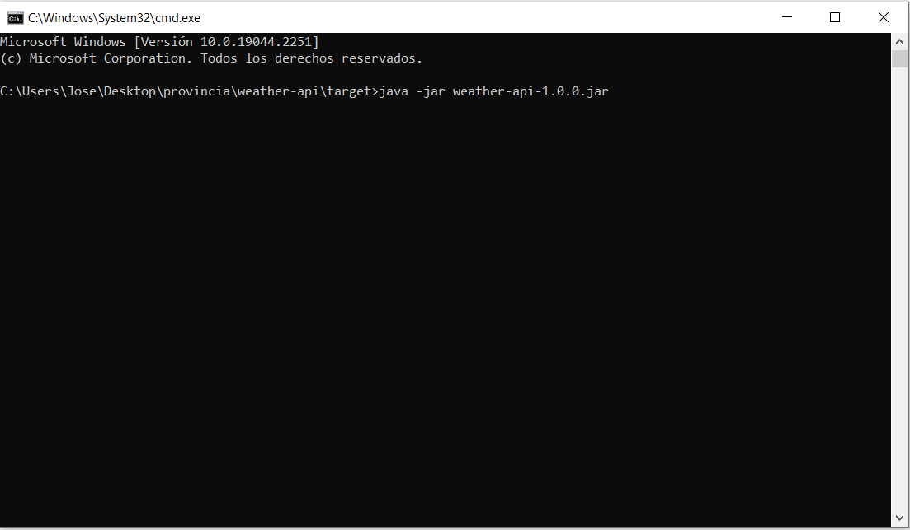
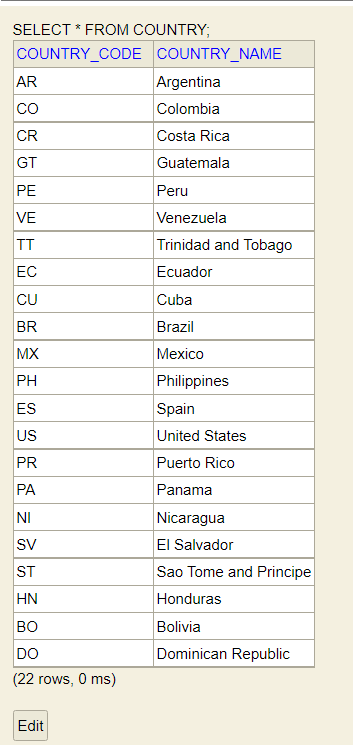

Nombre : Jose Orellana  
E-Mail: joseorellana.sistemas@gmail.com

##Getting started

1.Introduccion

   La finalidad del presente proyecto, es publicar un microservicio que informe el clima de un determinado
   lugar. Para lo cual, el mismo consume servicios del api publicada por Accuweather (https://developer.accuweather.com/)

 

2. Tecnologias

   + Spring Boot 2.7.6
   + Java 8
   + Base de datos H2
   + Maven
   + Lombook
   + Swagger

 
3. Detalles del desarrollo

   Dado que el servicio del clima publicado por Accuweather necesitaba de un codigo de localidad para poder ser consumido,
   en el api también se publica un servicio que obtiene los datos de las localidades (solo los que crei necesarios) con sus respectivos codigos, luego de la primer consulta,
   este servicio persiste los datos obtenidos en la base y son estos datos son los que el servicio va a devolver en su respuesta. Por lo que luego de la primer llamada, el servicio de Accuweather no vuelve a ser
   consumido, mientras que las tablas esten llenas.
   El servicio de consulta del clima, tiene el mismo funcionamiento, consume el servicio de Accuweather por unica vez, y una  vez que llenos las tablas
   las proximas ejecuciones, la data se obtiene de la base. 
    
   

    
4. Lanzamiento del proyecto
   
   El proyecto esta configurado para generar un .jar, podria haber sido entregado como war, pero un jar es 
   alternativa mas sencilla ya que, de esta manera se puede ejecutar el proyecto por linea de comandos
   sin necesidad de un servidor de aplicaciones gracias al tomcat embebido de spring.
   Para el lanzamiento del mismo se de tener configurada la variable de entorno de java 8 (JAVA_HOME) en el sistema.</b>
   Correr el comando "java -jar "directorioCompletoDelJar"

   Para verificar que el proyecto este levantado correctamente desde el navegador ir al swagger del api ("http://ip-servidor:8080/swagger-ui/index.html#/).
   desde el mismo se puede comprobar el funcionamiento de los servicios publicados

#Base de datos

Para el ingreso a la base de datos, se debe ingresar a la URL 

http://ip-servidor:8080/h2-console/

User Name: sa  
password: password

###Modelo para persistencia de localidades

###Modelo para guardado del clima de una locacion

# Funcionamiento de los servicios

   
   /api/v1/location/getLocations (recibe como query un nombre de una ciudad a buscar y devuelve los resultados que se acerquen al string pasado como parametro )

   

   una vez consumido el servicio, las tablas de la base ya se encontraran mapeadas. 

   

   

   

 

###Con los codigos obtenidos, se puede hacer la consulta del clima por codigo de localidad. 
 

   
   
   

####Resultado en la base. 

 

